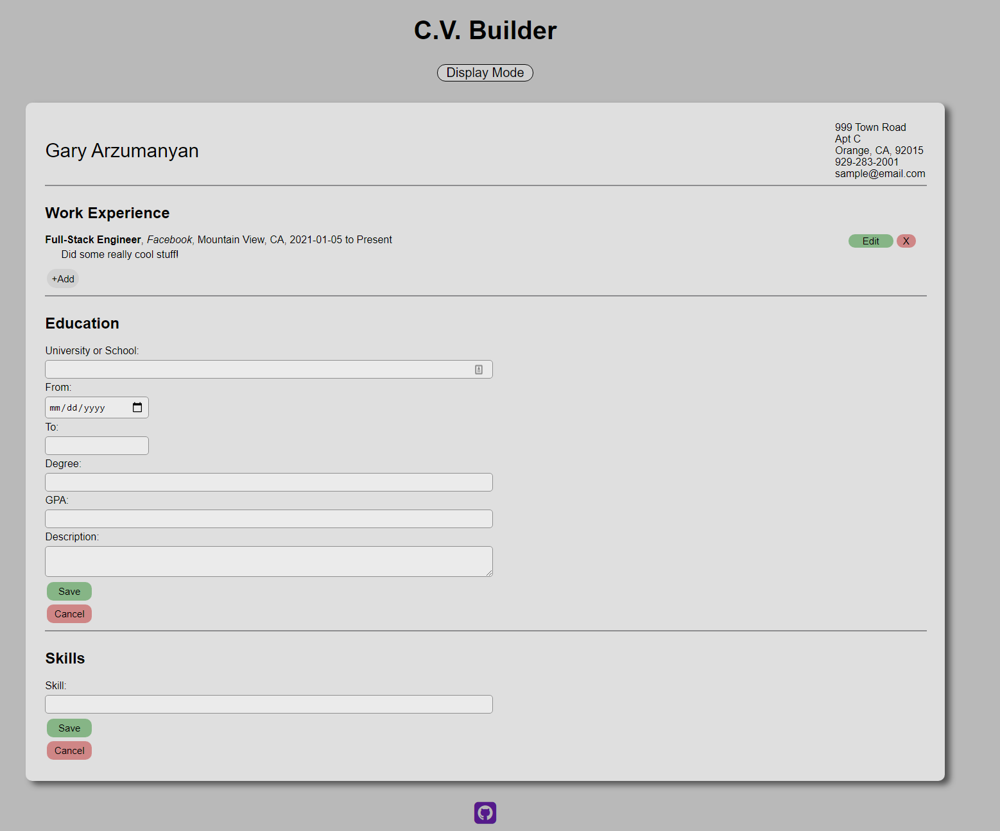

# CV-Builder

Web App that allows users to build their own CV/Resume with a nice template that allows them to easily add in their information, work experience, education, and skills.

Features:

    -An edit mode for entering in all your infomration and a display mode which shows the CV/Resume as it would look printed out.
    -Ability to edit, delete, or add as many items as you want under each section!
    -Easy to fill in and formats data for you with styling to make your resume look great.

Demonstrated Skills:

    -Uses the create-react-app to start the backbone of this project.
    -Uses React.js to handle all of the frontend using states, props and components with class based components.
    -Effectively uses the bind() function for React state functions so they can be used in callbacks for components.
    -Uses map() method to display all the different objects in the savedData array.
    -Uses React.js methods like render() to control the output to the DOM.

Future Ways to Improve:

    -The components for Work Experience, Education, and Skills repeat much of the same code.
     It would be nice to create 1 component and pass in an array of values for these instead of creating 3 separate components.

Overall project time: ~25 hours Date Completed: 1/18/2021

-Gary Arzumanyan

